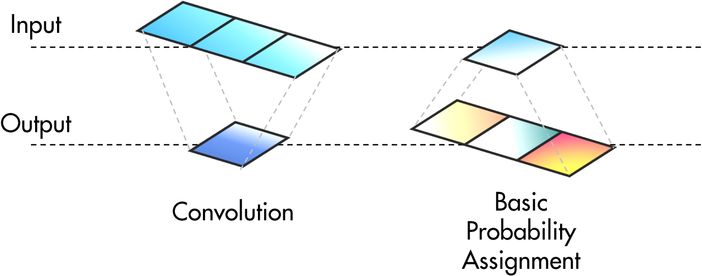

# Time-Evidence Fusion Network (TEFN): A Novel Backbone for Time Series Forecasting

## Overview
This is the official code implementation project for paper **"Time Evidence Fusion Network: Multi-source View in Long-Term Time Series Forecasting"**. The code implementation refers to [Time-Series-Library](https://github.com/thuml/Time-Series-Library). Thanks very much for [Time-Series-Library](https://github.com/thuml/Time-Series-Library)'s contribution to this project.


The **Time-Evidence Fusion Network (TEFN)** is a groundbreaking deep learning model designed for long-term time series forecasting. It integrates the principles of information fusion and evidence theory to achieve superior performance in real-world applications where timely predictions are crucial. TEFN introduces the Basic Probability Assignment (BPA) Module, leveraging fuzzy theory, and the Time Evidence Fusion Network to enhance prediction accuracy, stability, and interpretability.

## Key Features

- **Information Fusion Perspective**: TEFN addresses time series forecasting from a unique angle, focusing on the fusion of multi-source information to boost prediction accuracy.

- **BPA Module**: At its core, TEFN incorporates a BPA Module that maps diverse information sources to probability distributions related to the target outcome. This module exploits the interpretability of evidence theory, using fuzzy membership functions to represent uncertainty in predictions.


- **Interpretability**: Due to its roots in fuzzy logic, TEFN provides clear insights into the decision-making process, enhancing model explainability.


- **State-of-the-Art Performance**: TEFN demonstrates competitive results, with prediction errors comparable to leading models like PatchTST, while maintaining high efficiency and requiring fewer parameters than complex models such as Dlinear.

- **Robustness and Stability**: The model showcases resilience to hyperparameter tuning, exhibiting minimal fluctuations even under random selections, ensuring consistent performance across various settings.


- **Efficiency**: With optimized training times and a compact model footprint, TEFN is particularly suitable for resource-constrained environments.


## Getting Started

### Requirements

- Python >= 3.6
- PyTorch >= 1.7.0
- Other dependencies listed in `requirements.txt`

### Installation

Clone the repository:

```bash
git clone https://github.com/ztxtech/Time-Evidence-Fusion-Network.git
cd Time-Evidence-Fusion-Network
pip install -r requirements.txt
```

### Usage

#### Download Dataset

You can obtain datasets from [[Google Drive]](https://drive.google.com/drive/folders/13Cg1KYOlzM5C7K8gK8NfC-F3EYxkM3D2?usp=sharing) or [[Baidu Drive]](https://pan.baidu.com/s/1r3KhGd0Q9PJIUZdfEYoymg?pwd=i9iy), Then place the downloaded data in the folder`./dataset`. 

#### Load Config

The development of this project was modified from [Time-Series-Library](https://github.com/thuml/Time-Series-Library). Thanks very much for [Time-Series-Library](https://github.com/thuml/Time-Series-Library) open source code.

1. Modify the specific configuration file in `./run_config.py`.

```python
config_path = '{your chosen config file path}'
```
2. Run `./run_config.py` directly.
```bash
python run_config.py
```

#### Other Operations

Other related operations refer to [Time-Series-Library](https://github.com/thuml/Time-Series-Library).


#### Citation

If you find TEFN useful in your research, please cite our work as per the citation.

```bibtex


```

## Contact


If you have any questions or suggestions, feel free to contact:

Tianxiang Zhan [(zhantianxianguestc@hotmail.com)](mailto:zhantianxianguestc@hotmail.com)

Or describe it in Issues.
